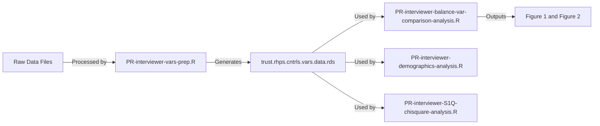

# **[TITLE]()**

<br>

## Authors: Kevin Wright, [Jacob T.N. Young](https://jacobtnyoung.github.io/), & Alexis Klemm

### ***Abstract***

ABSTRACT.


## Overview of Repository

### Folders

There are two folders:

  * The rodeo folder-this folder contains the cleaned data and the files to render the analyses.
  
  * The wrangling folder-this contains the raw data and the scripts to prepare the data for analysis (that is, the rodeo folder).

Each folder contains a README file that describes the contents of the folder in more detail.
  
## Workflow Map

The workflow map provides a visualization of the workflow:

```mermaid
graph LR
    A[PR-interviewer-vars-prep.R] --> B[trust.rhps.cntrls.vars.data.rds]
    
    B[trust.rhps.cntrls.vars.data.rds] --> C[PR-interviewer-balance-var-comparison-analysis.R]
    B[trust.rhps.cntrls.vars.data.rds] --> D[PR-interviewer-demographics-analysis.R]
    B[trust.rhps.cntrls.vars.data.rds] --> E[PR-interviewer-S1Q-chisquare-analysis.R]
    
    C[PR-interviewer-balance-var-comparison-analysis.R] --> F[Figure 1 and Figure 2]
    
graph TD
    1[raw data files] --> A[PR-interviewer-vars-prep.R]

```


